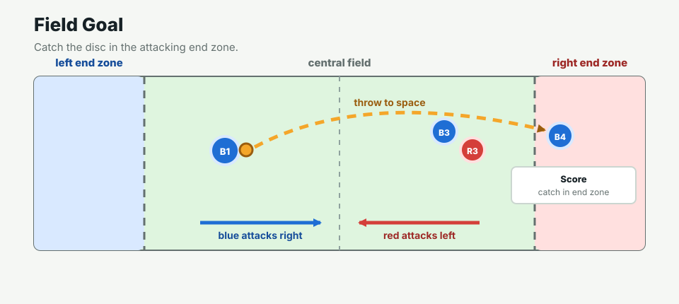

# Frisbee 5v5 Agent World

This is a simplified 5v5 frisbee world for LLM-controlled agents. The project focuses on the agent harness: observations, legal actions, model calls, simulator resolution, and replay/inspection tools.

## Try The Project

Clone the repository and run:

```bash
python3 scripts/serve_live_trial.py --port 8766
```

Open:

```text
http://127.0.0.1:8766/viewer/
```

The viewer loads the included 19-frame scoring demo even without an API token. Add `DEEPSEEK_API_KEY` to a local `.env` file only if you want to run a new live model-controlled point.

## Watch Example Runs

- [Open the 19-frame blue-score report](examples/final_demo_19f_score_report.html)
- [Open the 8-frame red-score report](examples/red_score_8f_live_report.html)

[Watch the silent UI demo video](media/frisbee-project-demo-video.mp4)

<video controls preload="metadata" style="width:100%;max-width:960px;border:1px solid #d0d7de;border-radius:8px">
  <source src="media/frisbee-project-demo-video.mp4" type="video/mp4">
</video>

The blue-score demo ends after 19 frames and used 135 API calls for an estimated `$0.112026`. The red-score live run ends after 8 frames and used 48 API calls for an estimated `$0.039028`.

## Simple Rules



- Blue attacks right. Red attacks left.
- The disc holder cannot run.
- A throw should lead a teammate into reachable space.
- A catch keeps possession.
- A block, interception, drop, out-of-bounds throw, or stall turnover changes possession.
- The first score ends this simulated point.

[Read the short visual rules guide](simple_frisbee_rules.md)

## Design Notes

- [Design index](design/README.md)
- [Development stages](design/development_stages.md)
- [System design](design/system_design.md)
- [Project structure](design/project_structure.md)
- [Observation and action space](design/observation_action_space.md)
- [Game rules and configuration](design/game_rules_and_config.md)
- [Cost and model setup](design/cost_and_models.md)
- [Changing models](design/model_switching.md)

The live Python server and model API calls must run locally; GitHub Pages only hosts the static project explanation and example output.
