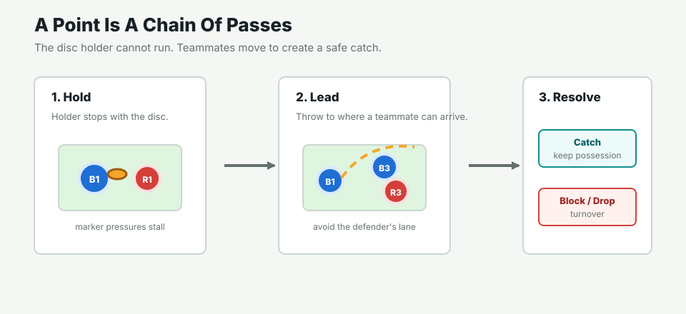
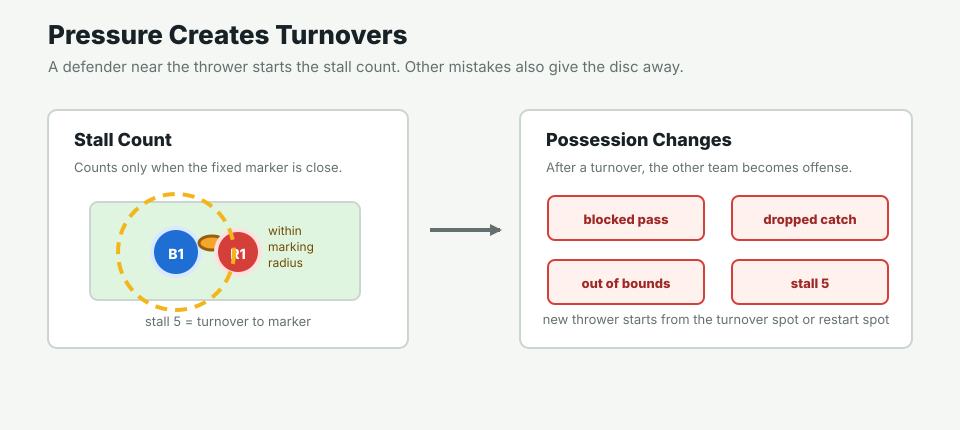

# Simple Frisbee Rules

This project uses a simplified 5v5, ultimate-style frisbee point. It is not a full official rulebook; it is the small rule set needed to understand the simulation.

## Goal

- Each team has 5 players.
- Blue scores by catching the disc in the right end zone.
- Red scores by catching the disc in the left end zone.
- The first score ends the simulated point.

## Possession And Passing

- The player holding the disc cannot run.
- Teammates without the disc move to open space.
- A throw should lead a teammate into a reachable catch point.
- A completed catch keeps possession.
- A block, interception, dropped catch, or out-of-bounds throw gives the disc to the other team.

## Defense, Stall, And Turnovers

- Each defender has one fixed matchup: B1 with R1, B2 with R2, and so on.
- A defender should stay near their matchup and contest the disc path.
- If the thrower's fixed defender is close enough, the stall count starts.
- In this simulation, stall 5 is a turnover.
- After a turnover, the other team immediately becomes offense.

## What The Project Adds

- The disc flies in a straight line at constant velocity.
- The simulator resolves movement, catches, blocks, scores, and turnovers.
- Agents choose legal actions from structured JSON.
- V2 uses an awake/sleep system: important players call the model, while sleeping players continue stored movement intents.
